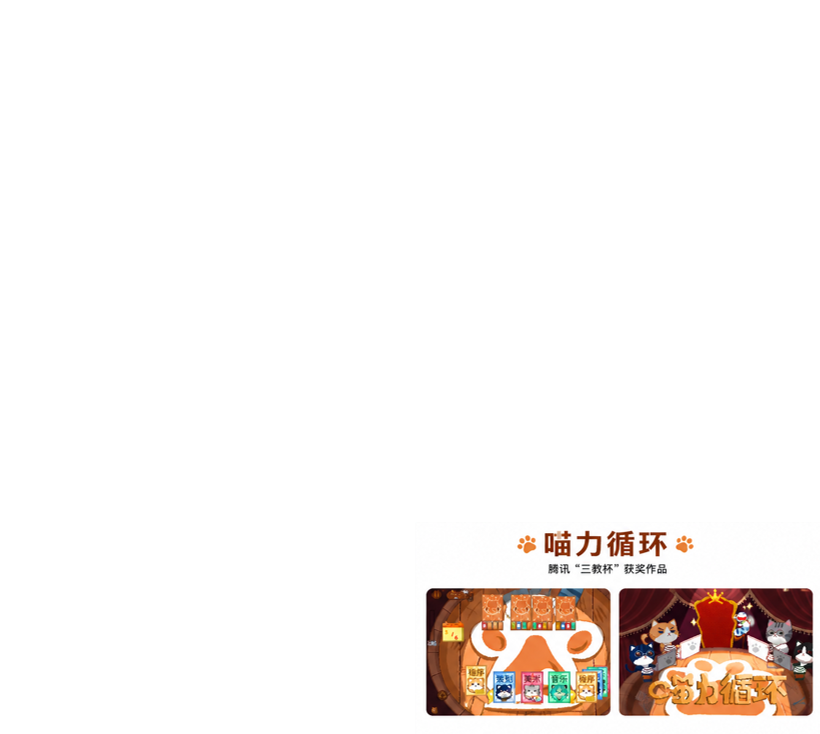

# 喵力循环 · Meow Loop

<p align="center">
  
</p>


<p align="center">
  腾讯“三教杯”获奖学生游戏作品<br>
  A student game project recognized in Tencent's “Sanjiao Cup”
</p>

<p align="center">
  <a href="#中文">中文</a> ·
  <a href="#english">English</a>
</p>

---

# 中文

## 项目简介

《喵力循环》是一款以游戏开发过程为主题的轻量卡牌游戏。玩家通过匹配不同类型的成员卡牌，组成能够完成任务的开发小组，并在有限的回合中处理程序、策划、美术、音乐等任务，逐步推进项目直至完成提交。

项目由五名学生共同完成，整合了玩法设计、程序实现、像素美术、音乐与文案，并作为作品参加腾讯“三教杯”游戏开发赛事并获奖。

## 核心玩法

- 通过匹配卡牌组建开发小组
- 根据成员类型完成不同类别的开发任务
- 在有限回合内安排程序、策划、美术与音乐资源
- 通过任务完成情况推进项目进度
- 以卡牌循环为核心形成短流程策略体验

## 游戏内容

游戏中的卡牌分别对应不同开发分工，包括：

- 程序
- 策划
- 美术
- 音乐

玩家需要根据任务要求选择并组合卡牌。不同任务对成员类型和数量有不同要求，合理安排卡牌使用顺序是推进游戏的关键。

## 开发信息

| 项目 | 内容 |
| --- | --- |
| 游戏引擎 | Unity |
| 编程语言 | C# |
| 游戏类型 | 卡牌 / 轻策略 |
| 目标平台 | Windows |
| 赛事 | 腾讯“三教杯” |
| 项目状态 | 已完成比赛提交版本 |

## 开发团队

| 成员 | 分工 |
| --- | --- |
| 李国辉 | 程序、策划 |
| 贾雨桐 | 策划、美术 |
| 廖开心 | 音乐、文案 |
| 邓力源 | 程序 |
| 朱诗雨 | 美术 |

## 运行方式

1. 克隆仓库：

```bash
git clone https://github.com/GaniHung/MeowCardGame.git
```

2. 使用 Unity 打开项目。

3. 在编辑器中运行主场景，或从 Releases 下载可执行版本。

> 推荐使用与项目原始开发环境相近的 Unity 版本打开。若出现兼容性问题，请优先检查 `ProjectSettings/ProjectVersion.txt`。

## 项目说明

本仓库用于保存比赛版本、项目代码与相关资源。项目中的原创美术、音乐和文案归对应创作者所有，未经许可请勿用于商业用途。

---

# English

## Overview

Meow Loop is a lightweight card game themed around the process of game development. Players match character cards to form a small development team and complete programming, design, art, and music tasks within a limited number of turns.

The project was developed by a five-person student team and combines gameplay design, programming, pixel art, music, and writing. It was submitted to Tencent's “Sanjiao Cup” game-development competition and received an award.


## Core Mechanics

- Match cards to assemble a development team
- Complete different task types using corresponding team-member cards
- Allocate programming, design, art, and music resources within limited turns
- Advance project progress by completing tasks
- Build a short strategy loop around card selection and reuse

## Game Content

The cards represent different roles in a student game-development team:

- Programming
- Game design
- Art
- Music

Each task requires a particular combination of roles and card counts. Planning when and how to use each card is the central strategic element of the game.

## Development Information

| Item | Details |
| --- | --- |
| Engine | Unity |
| Language | C# |
| Genre | Card game / Light strategy |
| Target platform | Windows |
| Competition | Tencent “Sanjiao Cup” |
| Status | Competition build completed |

## Team

| Member | Role |
| --- | --- |
| Guohui Li | Programming, Game Design |
| Yutong Jia | Game Design, Art |
| Kaixin Liao | Music, Writing |
| Liyuan Deng | Programming |
| Shiyu Zhu | Art |


## How to Run

1. Clone the repository:

```bash
git clone https://github.com/GaniHung/MeowCardGame.git
```

2. Open the project with Unity.

3. Run the main scene in the Unity Editor, or download a playable build from Releases.

> A Unity version close to the original development environment is recommended. If compatibility issues occur, check `ProjectSettings/ProjectVersion.txt`.

## Notes

This repository preserves the competition build, source code, and project assets. Original artwork, music, and written content remain the property of their respective creators and may not be used commercially without permission.
